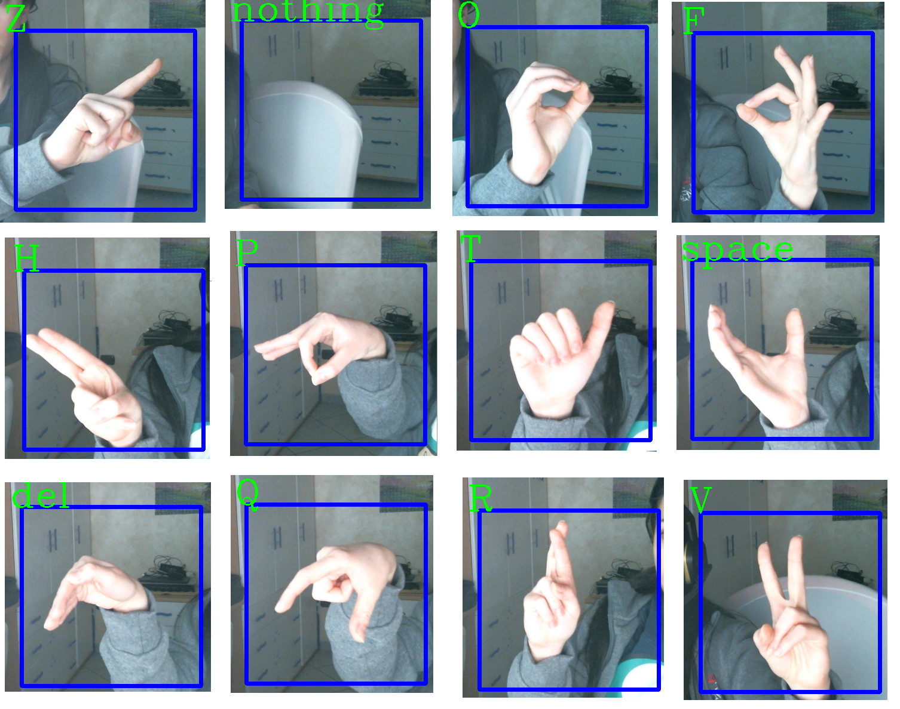

<h1 align = "center">  Recognition of the ASL Alphabet in real time using a CNN :computer: </h1>

 
The goal is to design a network that takes as input photos representing a hand in the position of one of the gestures of the ASL Alphabet and responds with the corresponding alphabet symbol.  
The recognition works in real time with a webcam. 

 Open the notebook file to know the details about how this was done. 

  

